# Books Exchange 

## Table of Contents
- [Books Exchange](#books-exchange)
  - [Overview](#overview)
  - [Setting Up](#setting-up)
- [User Guide](#user-guide)
  - [User Sign Up](#user-sign-up)
  - [User Log In](#user-log-in)
  - [Home Page](#home-page)
  - [Listings Page](#listings-page)
  - [Requests Page](#requests-page)
- [Future Plans](#future-plans)
  - [Upcoming Features](#upcoming-features)
    - [Search and Filter](#search-and-filter)
    - [Users Communication](#users-communication)
    - [Profile Customization](#profile-customization)
    - [Smart Recommendation](#smart-recommendation)
    - [Exisitng Features Improvements](#existing-features-improvements)
  - [UI Improvements](#ui-improvements)
  - [Performance Enhancements](#performance-enhancements)

## Overview
Books Exchange is a cross-platform mobile app that allows users to exchange unwanted physical books with others for new books that interest them.

## Setting Up

Due to the fact that deploying the app to App Store is not free of charge, the current version of the app is only functional on Android devices

If you are using an Android device, you may download the apk directly from [here](https://github.com/StevenGX12/BooksExchange_Flutter/releases/tag/v1.0) and use the app on your device. 

### Using Android Studio

1. Download Android Studio from [here](https://developer.android.com/studio).
2. Follow the default installation process to complete installing Android Studio.
3. Git clone this repo to your local machine.
4. Open Android Studio, click on **File** on the top left hand corner, navigate to the folder that contains this project and open this project.
5. From the root directory, go to **lib**, then open up **main.dart**.
6. In the **Help** tab at the top of Android Studio, click **Find Action**, then search for **Device Manager**. Alternatively, you may be able to find it on the right side of Android Studio.
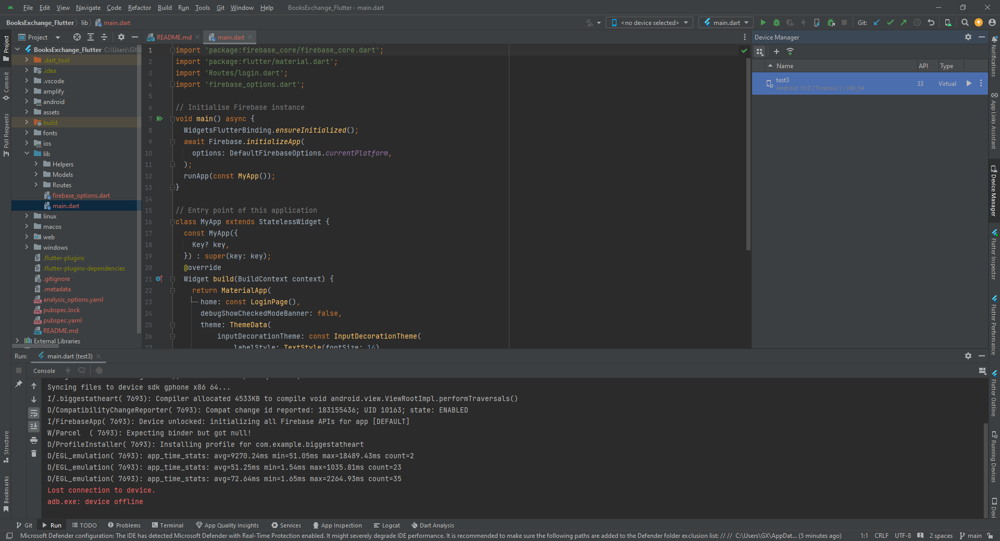
7. Inside the Device Manager, click on the  :heavy_plus_sign: that says **Create Virtual Device**.
8. Select a device of your choice (preferrably phone), click **Next**.
9. Choose **UpsideDownCake** or **Tiramisu** as the system image. Click on the small download button next to the system name and allow the download to complete before clicking **Next**.
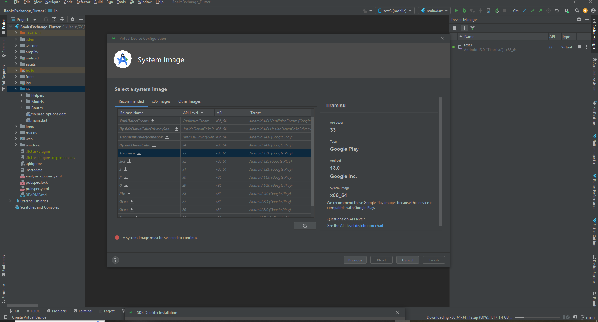
10. Give your virtual device a name (optional) and click **Finish** to finish setting up your virtual device.
11. At the top of Android Studio, in the **Flutter Device Selection**, choose the virutal machine that you just created. If it is not showing up as an option, click **Refresh** and try again.
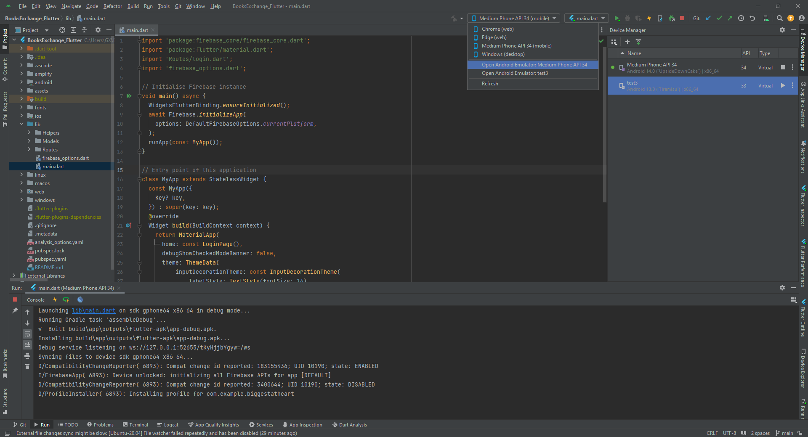
12. Ensure that **main.dart** is selected next to the **Flutter Device Selection**. Press **Run main.dart** (green triangle).
13. In the **Help** tab at the top of Android Studio, click **Find Action**, then search for **Running Devices**. Alternatively, you may be able to find it on the right side of Android Studio. This window can be isolated from the rest of the Android Studio and resized so that you can use the virtual device better.
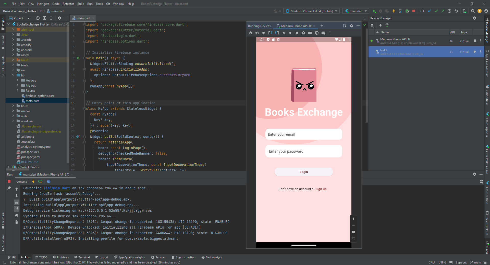

### Using BlueStacks X
1. Download BlueStacks X from [here](https://support.bluestacks.com/hc/en-us/categories/4407981230349-BlueStacks-X)
2. Follow the default installation process and open BlueStacks X on your computer
3. Download the app's apk from [here](https://github.com/StevenGX12/BooksExchange_Flutter/releases/tag/v1.0)
4. Follow the instructions [here](https://support.bluestacks.com/hc/en-us/articles/11054623928717-How-to-install-an-APK-on-BlueStacks-X) to open the apk that you just downloaded to use Books Exchange in BlueStacks X. 
5. Click on the **Rotate** at the right side of the window to make sure that the screen of the emulator is in portrait mode to ensure best user experience. 

[Back to table of contents](#table-of-contents)
## User Guide

### User Sign Up

When a new user is brought to the login page without an account, he or she can click on the `Sign Up` button at the bottom of the screen to navigate to a sign up page. 

There, new users will input their personal information as well as choosing their favourite genres from a drop-down menu as shown above. For security purposes, user's password must be **at least 8 characters, including 1 uppercase character, and 1 special character**.

Upon successful sign up, users will be navigated back to the Log In page.

[Back to table of contents](#table-of-contents)

### User Log In

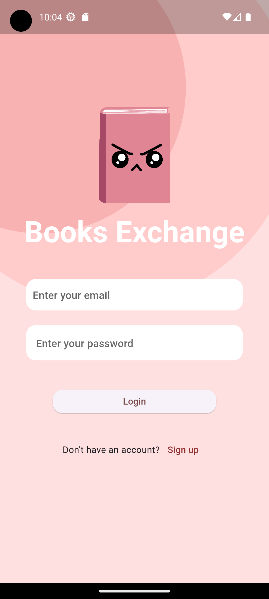

User can log in to their account by keying in their email and password, then clicking on `Log In` button.

Upon successful log in, users will be navigated to their Home page.

[Back to table of contents](#table-of-contents)

### Home Page

Upon successful login, users will be navigated to their respective home page. It should display their respective profile picture and user name on the top, and a list of books that they have listed for exchange. 

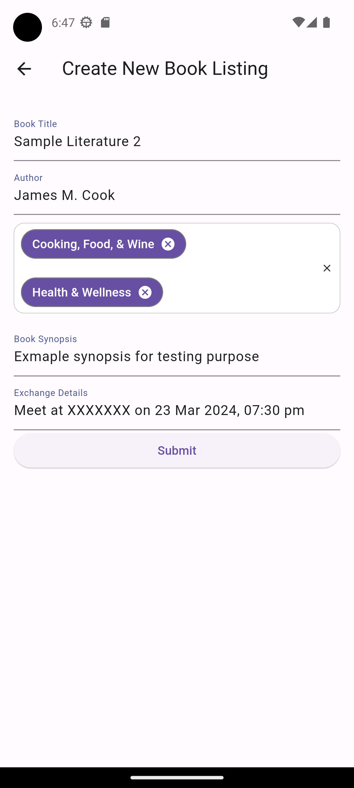

Clicking on the small add button at the side will bring user to this form, which allows them to add a new listing (book for exchange) as shown above.

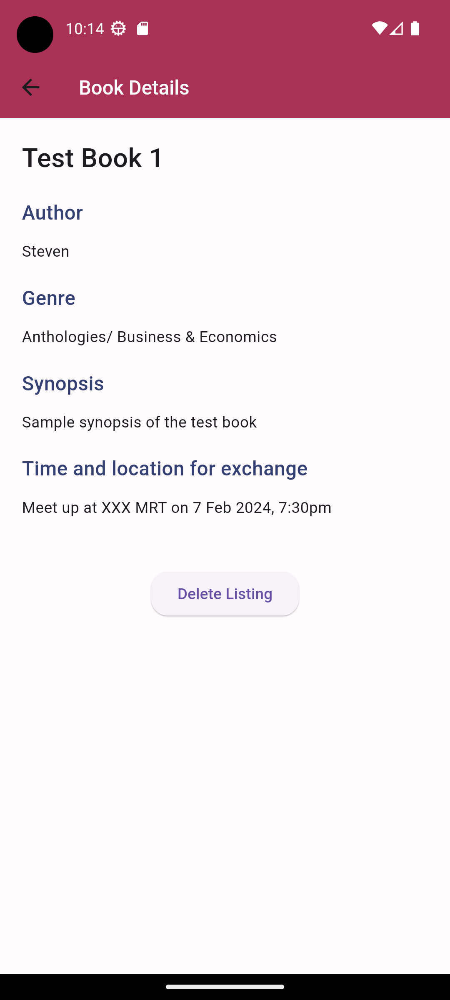

Users can click on these lisitngs to view the details of each listing. They can also choose to delete the listing by clicking on the `Delete Listing` button as shown above.

Users can log out of their account by clicking on the `logout` button at the top right of the home page.

Users can navigate to the following pages by clicking on one of the four buttons in the bottom navigation bar:
- `Home Page` - Display the user's information and current listings. 
- `Listings Page` - Users can view the list of other users' listings.
- `Exchange Requests Page` - Users can view all of their incoming/outgoing exchange requests.

**Note**: For details on the respective pages, check out the detailed guide under each feature.

[Back to table of contents](#table-of-contents)

### Listings Page

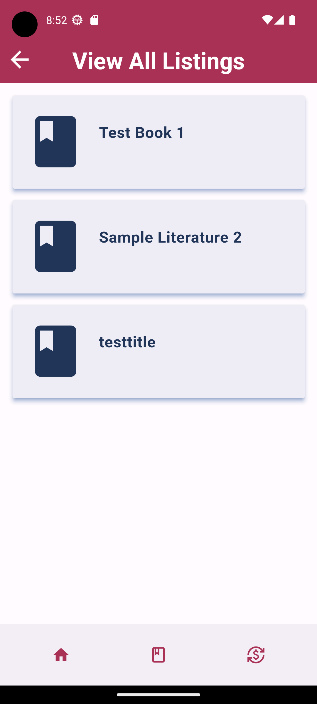

Upon clicking the second icon on the bottom navigation bar, users will be redirected to the `Listings Page`, where users can view all other users' books that are available for exchange.

#### View details of book listing

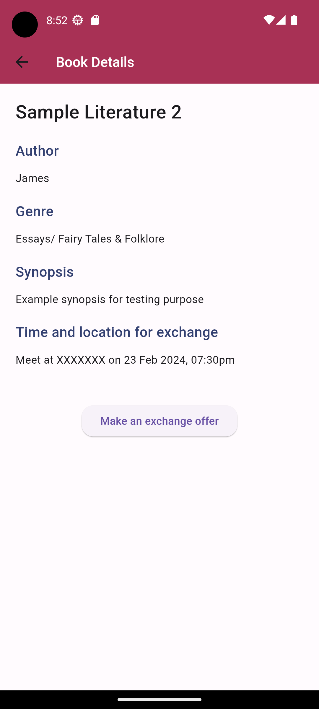

On the `Listings Page`, users can click on each book listing to view it in further detail. These include the book's title, author, genres and synopsis, as well as the time and location for exchanging the book.

#### Making a exchange request

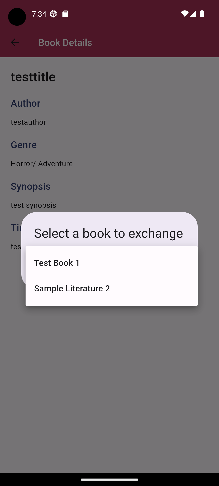

Upon entering the `Listing Details Page`, users will see the button `Make an exchange request` should they wish to exchange for this book. After clicking `Make an exchange request`, users will be prompted to select one of their own book listing for the exchange, before submitting this request to the person that posted this listing.

**Note:** After users select one of their own books to make the exchange request, the selected book listing will be considered **reserved**. This means that users will not be able to use that particular book to make other requests, nor can they see it in their home page. Other users will also not be able to see it in their `Listing Page`.

[Back to table of contents](#table-of-contents)

### Requests Page

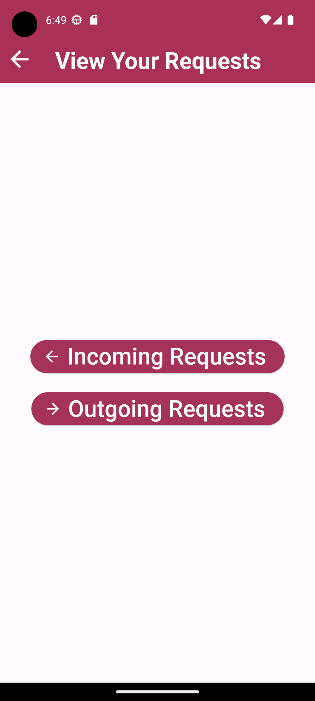

When navigated to the `Requests Page`, users will be greeted with 2 buttons to select from.

#### Incoming Requests

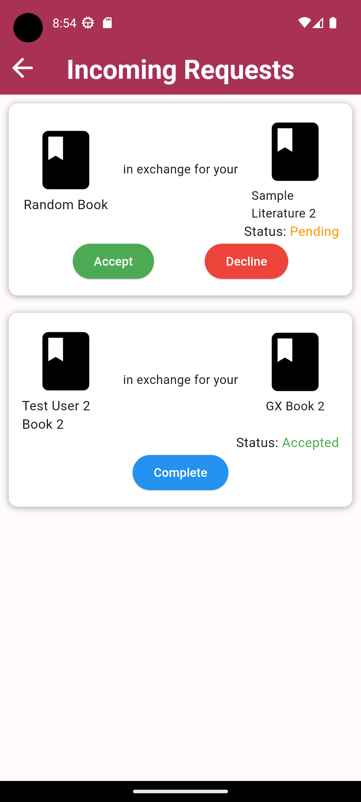

The `Incoming Requests` button will display all of the requests that other users have made towards a user's book listings. This user can decide whether he/she wishes to accept the exchange request or not. 

If the request is accepted, his/her book listing will also be considered **reserved**(similar to when he/she makes a request). The exchange request's status will be updated to `Accepted` for both parties involved as shown above.

If the request is declined, the request will be dismissed and no longer displayed for both parties. Additionally, the book listing that belongs to the user that initiated the exchange request will be released (no longer reserved) for him/her to use in other exchanges.

#### Outgoing Requests

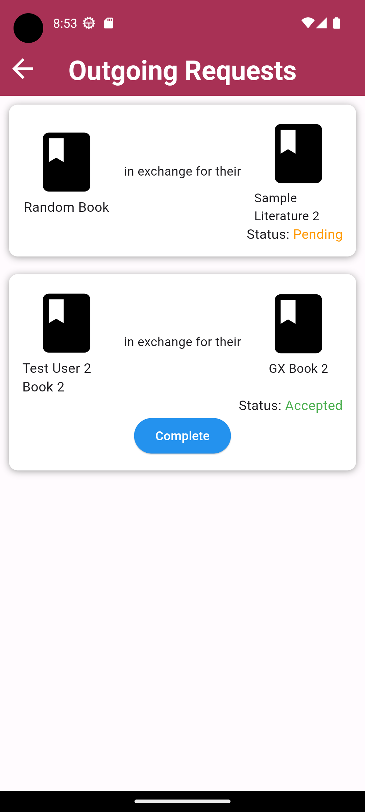

Similar to the abovementioned, the `Outgoing Requests` button will display all of the requests that a user made towards other users' book listings, with the exception that he/she can only wait for the other parties' acceptance / rejection.
The status of the request is reflected in a similar fashion as well.

#### Completing a exchange

In this curernt version, by default, the exchange will take place according to the time and location as stated by the user that receives the request and not the one that initiated it (Greater flexibility will be implemented in future versions). 

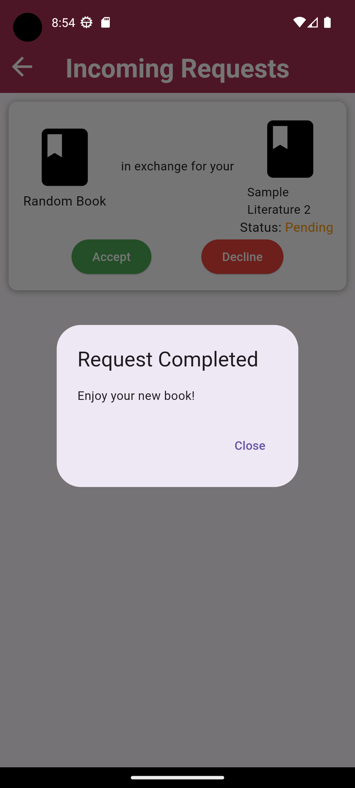

When the 2 parties meet and exchange the books, both of them can press the `Complete` button on their app to verify the completion of this exchange on their end. This will remove the exchange request from their respective ends (incoming/outgoing), along with a pop up notification as shown above. 

[Back to table of contents](#table-of-contents)

## Future Plans

### Upcoming Features

#### Search and Filter

In the `Listing Page`, users would be able to search for books using a search bar to search for the book title or author name. Additionally, users can also filter the book listings according to the different genres

#### Users Communication

The current version of the app does not support direct users interaction and communcation. Hence, future versions of the app would be directed at supporting users communication via direct messaging. This would allow users to have greater flexiblity in discussing about the time and location of the exchange, the conditions of the book, the availability of related books, or simply just conversing about the books that they may find interesting. 

#### Profile Customization

Future versions of the app will include a customizable profile page for users. They would be able to edit their personal information such as phone numbers and profile pictures as they wish.

#### Smart Recommendation

Future versions of the app will make use of the users' favourite genres, their past exchanges history, and potentially geographical location to recommend book listings to them. This can be done by introducing machine learning algorithms, or making use of AI models.

#### Existing Features Improvements

- Allow users to include images of the book they want to list out for exchanging
- Allow users to select multiple books for exchanging at once
- Allow users that initiated the exchange request to withdraw the request
- Allow users to modify their own book listings instead of only allowing deletion
- Allow users to view their past exchanges

### UI Improvements

Current version of the app attempts to focus on the functionality of existing core features. As a result, the UI of the app may not be very intuitive and user friendly. The aesthetics can also be further improved. Future versions of the app will cetainly look into making the UI more user friendly and aesthetically pleasing throught the use of smoother animations and cleaner graphics.

### Performance Enhancements

Future versions of the app will seek to have performance enhancements. This can be achieved via better refactoring of the code and introducing other means of improving performance such as caching data to avoid unnessary API latency and response time.
